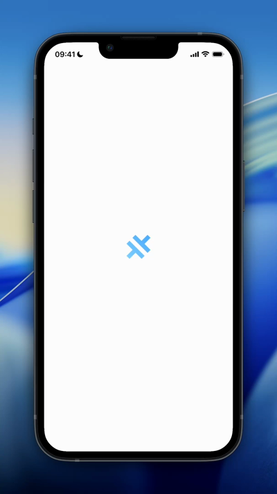
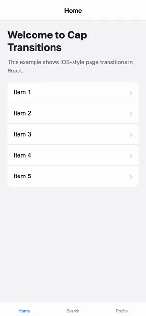

# @capgo/capacitor-transitions

<a href="https://capgo.app/">
  
</a>

Framework-agnostic page transitions for Capacitor apps. iOS-style navigation without opinions.

## Demo



## Features

- **Framework Agnostic** - Works with React, Vue, Angular, Svelte, Solid, and any other framework
- **iOS & Android Animations** - Platform-appropriate transitions out of the box
- **Web Animations API** - Smooth, GPU-accelerated animations
- **View Transitions API** - Optional progressive enhancement for supporting browsers
- **No Design Opinions** - Just transition logic, you bring your own styles
- **Coordinated Transitions** - Header, content, and footer animate together
- **Page Caching** - Keep pages in DOM for instant back navigation
- **Ionic-style iOS Swipe Back** - Optional edge gesture with Capacitor native iOS auto-enable
- **Lifecycle Hooks** - willEnter, didEnter, willLeave, didLeave events

## Compatibility

| Plugin version | Capacitor compatibility | Maintained |
| -------------- | ----------------------- | ---------- |
| v8.\*.\*       | v8.\*.\*                | ✅         |
| v7.\*.\*       | v7.\*.\*                | On demand  |
| v6.\*.\*       | v6.\*.\*                | ❌         |
| v5.\*.\*       | v5.\*.\*                | ❌         |

> **Note:** The major version of this plugin follows the major version of Capacitor. Use the version that matches your Capacitor installation (e.g., plugin v8 for Capacitor 8). Only the latest major version is actively maintained.

## Installation

You can use our AI-Assisted Setup to install the plugin. Add the Capgo skills to your AI tool using the following command:

```bash
npx skills add https://github.com/cap-go/capacitor-skills --skill capacitor-plugins
```

Then use the following prompt:

```text
Use the `capacitor-plugins` skill from `cap-go/capacitor-skills` to install the `@capgo/capacitor-transitions` plugin in my project.
```

If you prefer Manual Setup, install the plugin by running the following commands and follow the platform-specific instructions below:

```bash
npm install @capgo/capacitor-transitions
```

## Quick Start

### Vanilla JavaScript / Web Components

```html
<cap-router-outlet platform="auto">
  <cap-page>
    <cap-header slot="header">
      <h1>My Page</h1>
    </cap-header>
    <cap-content slot="content">
      <p>Page content here</p>
    </cap-content>
    <cap-footer slot="footer">
      <nav>Tab bar</nav>
    </cap-footer>
  </cap-page>
</cap-router-outlet>
```

```javascript
import '@capgo/capacitor-transitions';

// Navigate programmatically
const outlet = document.querySelector('cap-router-outlet');
outlet.push(newPageElement);
outlet.pop();
outlet.setRoot(newRootElement);
outlet.setRoot(onboardingDoneElement, { direction: 'forward' });

// For router-driven replace/reset flows, reset the stack but keep a forward slide.
outlet.setNavigation('root', 'forward');
yourRouter.replace('/home');
```

### React

```tsx
import { useRef, useEffect } from 'react';
import { useNavigate } from 'react-router-dom';
import {
  initTransitions,
  setDirection,
  setNavigation,
  setupPage,
  setupRouterOutlet,
} from '@capgo/capacitor-transitions/react';
import '@capgo/capacitor-transitions';

// Initialize once at app startup
initTransitions({ platform: 'auto' });

function App() {
  const outletRef = useRef<HTMLElement>(null);

  useEffect(() => {
    if (outletRef.current) {
      setupRouterOutlet(outletRef.current, { platform: 'auto', swipeGesture: 'auto' });
    }
  }, []);

  return (
    <cap-router-outlet ref={outletRef}>
      <Routes>
        <Route path="/" element={<HomePage />} />
        <Route path="/details/:id" element={<DetailsPage />} />
      </Routes>
    </cap-router-outlet>
  );
}

function HomePage() {
  const navigate = useNavigate();
  const pageRef = useRef<HTMLElement>(null);

  useEffect(() => {
    if (pageRef.current) {
      return setupPage(pageRef.current, {
        onDidEnter: () => console.log('entered'),
      });
    }
  }, []);

  const goToDetails = (id: number) => {
    setDirection('forward');
    navigate(`/details/${id}`);
  };

  const finishOnboarding = () => {
    setNavigation('root', 'forward');
    navigate('/home', { replace: true });
  };

  return (
    <cap-page ref={pageRef}>
      <cap-header slot="header">
        <h1>Home</h1>
      </cap-header>
      <cap-content slot="content">
        <button onClick={() => goToDetails(1)}>Go to Details</button>
      </cap-content>
      <cap-footer slot="footer">
        <nav>Tab bar</nav>
      </cap-footer>
    </cap-page>
  );
}
```

#### React JSX TypeScript setup

Importing from `@capgo/capacitor-transitions/react` registers the web components and includes React JSX typings for `cap-router-outlet`, `cap-page`, `cap-header`, `cap-content`, and `cap-footer`. In most React projects, the import in the example above is enough.

If TypeScript still shows `Property 'cap-router-outlet' does not exist on type 'JSX.IntrinsicElements'`, add a project declaration file:

```ts
// src/capgo-transitions.d.ts
import '@capgo/capacitor-transitions/react';
```

Then make sure TypeScript includes it:

```json
{
  "include": ["src", "src/capgo-transitions.d.ts"]
}
```

For Vite, Create React App, and most webpack React apps, putting `capgo-transitions.d.ts` inside `src/` is enough. For Next.js, put it in `src/` or the project root and keep it included in `tsconfig.json`. For custom TypeScript or webpack setups with a separate `types/` folder, add that folder to `tsconfig.json`:

```json
{
  "include": ["src", "types"]
}
```

### Vue

```vue
<script setup>
import { ref, onMounted, onUnmounted } from 'vue';
import { useRouter } from 'vue-router';
import { initTransitions, setDirection, setupPage, setupRouterOutlet } from '@capgo/capacitor-transitions/vue';
import '@capgo/capacitor-transitions';

// Initialize once
initTransitions({ platform: 'auto' });

const router = useRouter();
const outletRef = ref(null);
const pageRef = ref(null);
let cleanup;

onMounted(() => {
  if (outletRef.value) {
    setupRouterOutlet(outletRef.value, { platform: 'auto' });
  }
  if (pageRef.value) {
    cleanup = setupPage(pageRef.value, {
      onDidEnter: () => console.log('entered'),
    });
  }
});

onUnmounted(() => cleanup?.());

const goToDetails = (id) => {
  setDirection('forward');
  router.push(`/details/${id}`);
};
</script>

<template>
  <cap-router-outlet ref="outletRef">
    <cap-page ref="pageRef">
      <cap-header slot="header">
        <h1>Home</h1>
      </cap-header>
      <cap-content slot="content">
        <button @click="goToDetails(1)">Go to Details</button>
      </cap-content>
    </cap-page>
  </cap-router-outlet>
</template>
```

### Svelte

```svelte
<script>
  import { routerOutlet, page, setDirection } from '@capgo/capacitor-transitions/svelte'
  import '@capgo/capacitor-transitions'

  function navigate(to, direction = 'forward') {
    setDirection(direction)
    // Use your router's navigate function
  }
</script>

<cap-router-outlet use:routerOutlet>
  <cap-page use:page={{ onDidEnter: () => console.log('entered') }}>
    <cap-header slot="header">
      <h1>Home</h1>
    </cap-header>
    <cap-content slot="content">
      <button on:click={() => navigate('/details/1')}>Go to Details</button>
    </cap-content>
  </cap-page>
</cap-router-outlet>
```

### Solid

```tsx
import { onMount, onCleanup } from 'solid-js';
import { useNavigate } from '@solidjs/router';
import { initTransitions, setDirection, setupPage, setupRouterOutlet } from '@capgo/capacitor-transitions/solid';
import '@capgo/capacitor-transitions';

// Initialize once
initTransitions({ platform: 'auto' });

function HomePage() {
  const navigate = useNavigate();
  let pageRef;

  onMount(() => {
    if (pageRef) {
      const cleanup = setupPage(pageRef, {
        onDidEnter: () => console.log('entered'),
      });
      onCleanup(cleanup);
    }
  });

  const goToDetails = (id) => {
    setDirection('forward');
    navigate(`/details/${id}`);
  };

  return (
    <cap-page ref={pageRef}>
      <cap-header slot="header">
        <h1>Home</h1>
      </cap-header>
      <cap-content slot="content">
        <button onClick={() => goToDetails(1)}>Go to Details</button>
      </cap-content>
    </cap-page>
  );
}
```

### Angular

```typescript
// app.component.ts
import { Component, CUSTOM_ELEMENTS_SCHEMA, ElementRef, ViewChild, AfterViewInit } from '@angular/core';
import '@capgo/capacitor-transitions';

@Component({
  selector: 'app-root',
  schemas: [CUSTOM_ELEMENTS_SCHEMA],
  template: `
    <cap-router-outlet #outlet platform="auto">
      <router-outlet></router-outlet>
    </cap-router-outlet>
  `,
})
export class AppComponent {}

// home.component.ts
@Component({
  selector: 'app-home',
  schemas: [CUSTOM_ELEMENTS_SCHEMA],
  template: `
    <cap-page>
      <cap-header slot="header">
        <h1>Home</h1>
      </cap-header>
      <cap-content slot="content">
        <button (click)="goToDetails(1)">Go to Details</button>
      </cap-content>
    </cap-page>
  `,
})
export class HomeComponent {
  constructor(private router: Router) {}

  goToDetails(id: number) {
    this.router.navigate(['/details', id]);
  }
}
```

## Use With @capgo/native-navigation

Use `@capgo/native-navigation` when the native layer should own the navbar or tabbar, and use `@capgo/capacitor-transitions` for the WebView page content underneath that native chrome.

```bash
npm install @capgo/capacitor-transitions @capgo/native-navigation
npx cap sync
```

Configure native chrome first:

```typescript
import { NativeNavigation } from '@capgo/native-navigation';

await NativeNavigation.configure({
  contentInsetMode: 'css',
});

await NativeNavigation.setNavbar({
  title: 'Inbox',
  backButton: { visible: false },
});
```

Keep the transition outlet focused on pages, not native bars:

```html
<cap-router-outlet platform="auto" swipe-gesture="auto">
  <cap-page>
    <cap-content slot="content" fullscreen>
      <main class="native-page">Inbox content</main>
    </cap-content>
  </cap-page>
</cap-router-outlet>
```

```css
.native-page {
  padding-top: var(--cap-native-navigation-top);
  padding-bottom: var(--cap-native-navigation-bottom);
}
```

Drive both packages from the same router actions:

```typescript
import { NativeNavigation } from '@capgo/native-navigation';
import { setDirection, setNavigation } from '@capgo/capacitor-transitions/react';
import { router } from './router';

await NativeNavigation.addListener('navbarBack', () => {
  setDirection('back');
  router.back();
});

async function openMessage(id: string) {
  setDirection('forward');
  router.push(`/message/${id}`);

  await NativeNavigation.setNavbar({
    title: 'Message',
    backButton: { visible: true, title: 'Inbox' },
  });
}

async function finishOnboarding() {
  setNavigation('root', 'forward');
  router.replace('/inbox');

  await NativeNavigation.setNavbar({
    title: 'Inbox',
    backButton: { visible: false },
  });
}
```

Do not render the native top bar again as a moving `<cap-header>`. Native Navigation keeps the bar native; this package animates the web page body.

## API Reference

### Components

#### `<cap-router-outlet>`

Container for page transitions.

| Attribute       | Type                           | Default          | Description                                                                        |
| --------------- | ------------------------------ | ---------------- | ---------------------------------------------------------------------------------- |
| `platform`      | `'ios' \| 'android' \| 'auto'` | `'auto'`         | Animation style                                                                    |
| `duration`      | `number`                       | Platform default | Animation duration in ms                                                           |
| `keep-in-dom`   | `boolean`                      | `true`           | Keep pages in DOM after navigating away                                            |
| `max-cached`    | `number`                       | `10`             | Maximum pages to keep cached                                                       |
| `swipe-gesture` | `boolean \| 'auto'`            | `'auto'`         | Enable edge swipe-back gesture. `'auto'` enables only in native iOS Capacitor apps |

Methods:

- `push(element, config?)` - Navigate forward to new page
- `pop(config?)` - Navigate back
- `setRoot(element, config?)` - Replace navigation stack. Pass `{ direction: 'forward' }` to reset the stack with a forward slide.
- `setNavigation(action, direction?)` - Set the stack action and animation direction for the next router-driven navigation
- `setSwipeGesture(true | false | 'auto')` - Enable, disable, or auto-detect edge swipe-back gesture

`swipe-gesture="auto"` uses Capacitor's runtime helpers (`Capacitor.isNativePlatform()` and `Capacitor.getPlatform()`) and enables the gesture only for native iOS apps. Use `swipe-gesture="true"` to force it on any platform or `swipe-gesture="false"` to disable it.

#### `<cap-page>`

Page container with header/content/footer slots.

Events:

- `cap-will-enter` - Before page becomes visible
- `cap-did-enter` - After page becomes visible
- `cap-will-leave` - Before page leaves
- `cap-did-leave` - After page leaves

#### `<cap-header>`

Header container. Use with `slot="header"` inside `<cap-page>`.

#### `<cap-content>`

Main scrollable content area. Use with `slot="content"`.

| Attribute    | Type      | Default | Description                   |
| ------------ | --------- | ------- | ----------------------------- |
| `fullscreen` | `boolean` | `false` | Content scrolls behind header |
| `scroll-x`   | `boolean` | `true`  | Enable horizontal scroll      |
| `scroll-y`   | `boolean` | `true`  | Enable vertical scroll        |

#### `<cap-footer>`

Footer container. Use with `slot="footer"`.

### Transition Directions

| Direction   | Description                            |
| ----------- | -------------------------------------- |
| `'forward'` | Push animation (iOS: slide from right) |
| `'back'`    | Pop animation (iOS: slide to right)    |
| `'root'`    | Replace animation (fade)               |
| `'none'`    | No animation                           |

### Navigation Actions

Navigation actions control the recorded stack independently from the visual animation. This is useful when a router `replace` or native navigation reset should feel like a forward page push but must not leave a swipe-back entry behind.

```typescript
setNavigation('root', 'forward');
router.replace('/home');
```

`setNavigation('root', 'forward')` clears the transition stack after the navigation and plays the forward animation. Swipe-back stays disabled because there is no previous page.

### Helper Functions

All framework bindings export these helper functions:

```typescript
// Initialize the transition system
initTransitions({ platform: 'auto' });

// Set the direction for the next navigation
setDirection('forward' | 'back' | 'root' | 'none');

// Set the stack action and animation direction for the next navigation
setNavigation('root', 'forward');
setNavigation('root'); // direction is optional and defaults to the same value as the stack action.

// Set up a router outlet element
setupRouterOutlet(element, options);

// Auto-enable the iOS edge swipe-back gesture in native Capacitor iOS apps
setupRouterOutlet(element, { swipeGesture: 'auto' });

// Force enable or disable from JavaScript
setupRouterOutlet(element, { swipeGesture: true });
setupRouterOutlet(element, { swipeGesture: false });

// Set up a page element with lifecycle callbacks (returns cleanup function)
setupPage(element, { onWillEnter, onDidEnter, onWillLeave, onDidLeave });

// Create a transition-aware navigate function
const transitionNavigate = createTransitionNavigate(navigate);
transitionNavigate('/path', 'forward');
```

### TransitionController

For advanced programmatic control:

```typescript
import { createTransitionController } from '@capgo/capacitor-transitions';

const controller = createTransitionController({
  platform: 'auto',
  duration: 400,
  useViewTransitions: true,
});

// Navigate
await controller.push(element, { direction: 'forward' });
await controller.pop({ direction: 'back' });
await controller.setRoot(element, { direction: 'root' });
await controller.setRoot(element, { direction: 'forward' });

// Lifecycle hooks
controller.registerLifecycle('page-id', {
  onWillEnter: (event) => console.log('Will enter', event),
  onDidEnter: (event) => console.log('Did enter', event),
  onWillLeave: (event) => console.log('Will leave', event),
  onDidLeave: (event) => console.log('Did leave', event),
});
```

## Browser Support

- Modern browsers with Web Animations API support
- Optional View Transitions API (Chrome 111+, Edge 111+, Safari 18+) support
- Graceful fallback for older browsers

## Design Philosophy

This library is intentionally unopinionated about styling:

1. **Minimal structural CSS** - You bring your own visual system
2. **No design system** - Works with any UI library or custom styles
3. **Just transitions** - Focus on smooth page navigation
4. **Framework agnostic** - Use with React, Vue, Angular, Svelte, Solid, or vanilla JS

The goal is to provide Ionic-quality page transitions without Ionic's design system or framework lock-in.

## Examples

See the `/examples` directory for complete examples:

- `react-app` - React with React Router
- `vue-app` - Vue 3 with Vue Router
- `angular-app` - Angular with Angular Router
- `svelte-app` - Svelte 5
- `solid-app` - Solid with Solid Router
- `tanstack-app` - React with TanStack Router

### React Example

The React example demonstrates iOS-style page transitions with smooth animations:



<table>
  <tr>
    <td align="center">
      
      <br />
      <strong>Home Page</strong>
    </td>
    <td align="center">
      
      <br />
      <strong>Details Page</strong>
    </td>
    <td align="center">
      
      <br />
      <strong>Nested Page</strong>
    </td>
  </tr>
</table>

Features demonstrated:

- Forward navigation with slide-in animation
- Back navigation with slide-out animation
- Multi-level page stack
- Coordinated header/content/footer transitions

To run the React example:

```bash
cd examples/react-app
npm install
npm run dev
```

### Mobile Demo App

The repository also includes a Capacitor shell for testing the React demo on real devices and through Capgo. It uses the app id `app.capgo.capacitor.transitions`, app name `Capgo Transitions`, and `examples/react-app/dist` as the native web bundle.

Capacitor CLI requires Node.js 22 or newer.

To build and copy the demo into the native projects:

```bash
npm install
npm run build:mobile
npx cap sync
```

To run it locally:

```bash
npx cap run ios
npx cap run android
```

To deploy an OTA bundle to Capgo:

```bash
npm run build:mobile
npx @capgo/cli@latest bundle upload app.capgo.capacitor.transitions --channel dev --delta
```

## License

MIT
